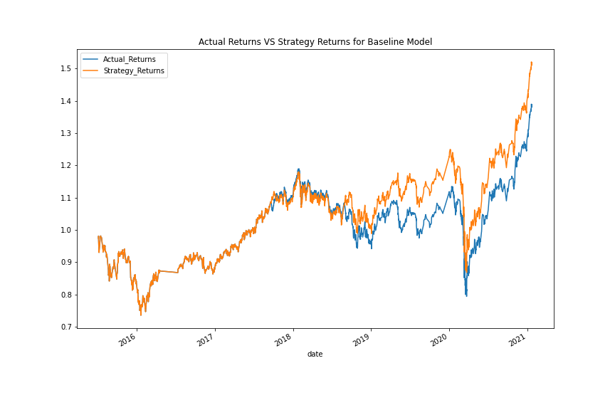
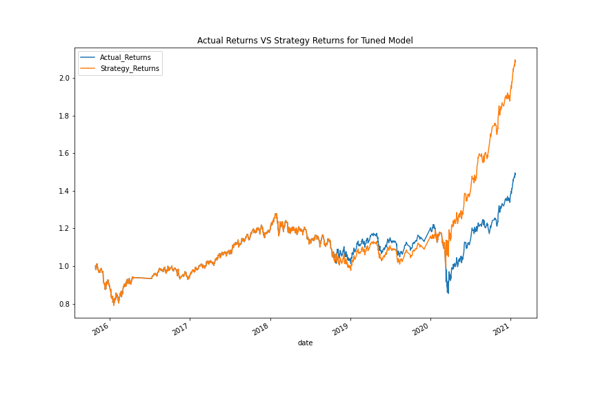
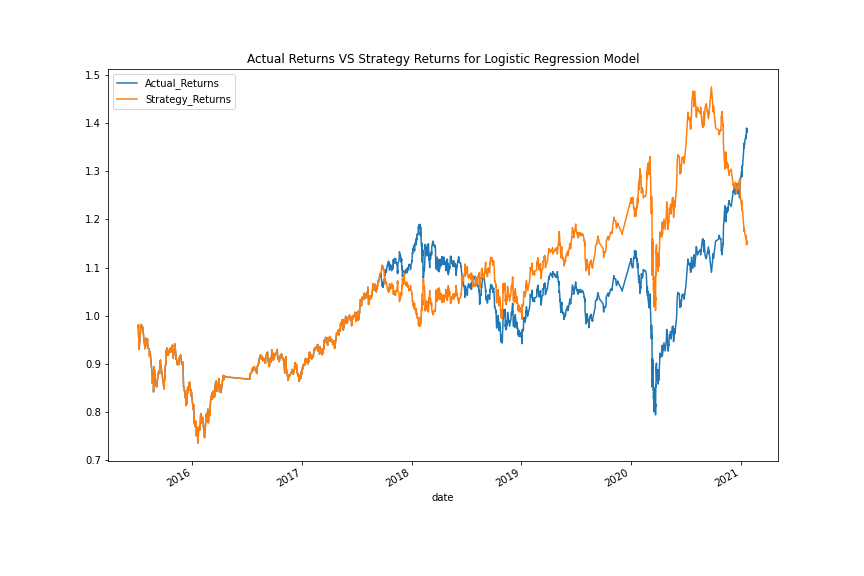

# Machine_Learning_Trading_Bot

## Establish a Baseline Performance

The Baseline Model is trained on 3 months of data with a Simple Moving Average short window of 4 and a long window of 100. 

The cumulative return on this strategy at the end of the test period is 151.76%. This is a good result but we can improve it by tuning the model.

## Tuning the Baseline Trading Algorithm

I started tuning the model by adjusting the time period of the testing data. When I found a higher value I attempted to 'hone-in' on either side of that value.

3 months = 151.76%

45 days = 133.89%

6 months = 184.17%

12 months = 164.64%

135 days = 167.18%

9 months = 162.56%

7 months = 181.00%

5 months = 159.16%

195 days = 191.63%

187 days = 179.03%

203 days = 176.92%

I settled on 195 days and then used this value to optimise the SMA rolling window sizes:

(4, 100) = 191.63%

(2, 50) = 96.02%

(8, 200) = 120.21%

(2, 200) = 74.32%

(8, 50) = 100.19%

(4, 150) = 209.18%

(3, 150) = 174.51%

(5, 150) = 188.57%

(4, 175) = 150.51%

(4, 125) = 171.26%

(4, 138) = 191.97%

(4, 162) = 128.45%

(4, 144) = 178.65%

(4, 148) = 182.84%

(4, 154) = 195.76%

(4, 152) = 189.94%

The best combination I was able to find was a short window of 4 and a long window of 150.

The Tuned Model resulted in cumulative returns of 209.18%. An improvement of 57.42% over the Baseline model.

## Evaluating a New Machine Learning Classifier

Finally I used the original parameters but applied them to the performance of a Logistic Regression Model.

The Logistic Regression Model performed a lot worse than the both the Baseline and Tuned Support Vector Machines Models with a final cumulative return of 114.93%. However, given how much improvement can be gained through tuning, it may have more potential. 

## Contributors

Owen Harris. 

